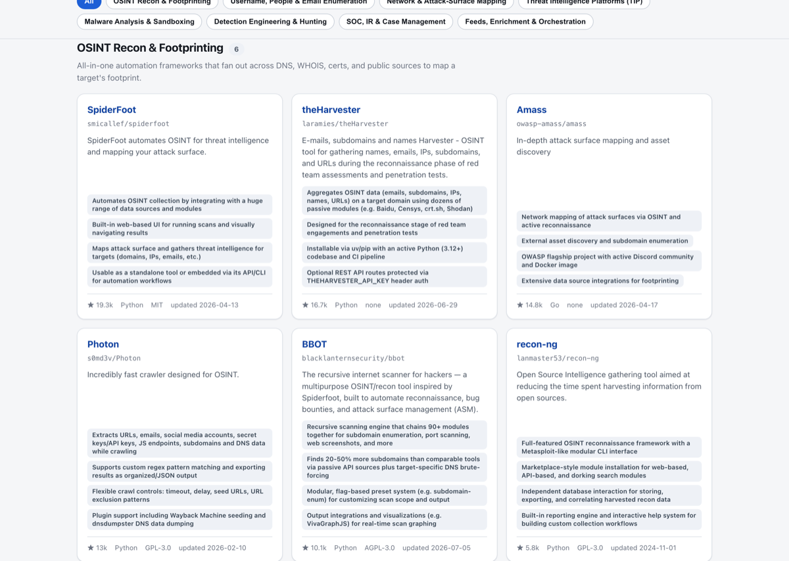

# 🛰️ OSINT & Threat Intelligence Toolkit

[](https://recuon.github.io/threat-intel-osint-dashboard/)    

A curated, GitHub-API-verified catalog of **52 open-source OSINT and threat-intelligence tools** across **8 categories**, presented as a single self-contained static page with instant search, category filtering, sorting, and a light/dark theme. Every star count, language, license, and last-updated date was fetched live from the GitHub REST API and can be re-verified against the machine-readable [`tools.json`](tools.json).

**[▶ View the live dashboard](https://recuon.github.io/threat-intel-osint-dashboard/)**



## Table of Contents

- [What is this?](#what-is-this)
- [Categories](#categories)
- [Tool catalog](#tool-catalog)
  - [OSINT Recon & Footprinting](#osint-recon-footprinting)
  - [Username, People & Email Enumeration](#username-people-email-enumeration)
  - [Network & Attack-Surface Mapping](#network-attack-surface-mapping)
  - [Threat Intelligence Platforms (TIP)](#threat-intelligence-platforms-tip)
  - [Malware Analysis & Sandboxing](#malware-analysis-sandboxing)
  - [Detection Engineering & Hunting](#detection-engineering-hunting)
  - [SOC, IR & Case Management](#soc-ir-case-management)
  - [Feeds, Enrichment & Orchestration](#feeds-enrichment-orchestration)
- [Methodology](#methodology)
- [Run locally](#run-locally)
- [Project structure](#project-structure)
- [Contributing](#contributing)
- [Disclaimer](#disclaimer)
- [License](#license)
- [Acknowledgements](#acknowledgements)

## What is this?

This project is a curated, GitHub-API-verified catalog of the best open-source OSINT and threat-intelligence tooling on GitHub. It is delivered as a **single self-contained static page** ([`index.html`](index.html)) — no build step, no backend, and zero external runtime requests. Everything (data, styles, and scripts) is embedded in the one file.

The dashboard lets you:

- **Search** tools by name, description, or key features.
- **Filter** by any of the 8 categories.
- **Sort** by stars, name, or most recently updated.
- Toggle a **light/dark theme**.

Every tool card links straight to its GitHub repository, and the underlying data is mirrored in [`tools.json`](tools.json) for programmatic use.

## Categories

- **OSINT Recon & Footprinting** (6) — All-in-one automation frameworks that fan out across DNS, WHOIS, certs, and public sources to map a target's footprint.
- **Username, People & Email Enumeration** (7) — Find accounts, emails, phone numbers and people across thousands of sites and services.
- **Network & Attack-Surface Mapping** (8) — Scan, probe, and enumerate hosts, ports, subdomains and web surfaces at speed.
- **Threat Intelligence Platforms (TIP)** (6) — Store, structure, correlate and share IOCs, TTPs and threat data across teams.
- **Malware Analysis & Sandboxing** (6) — Static, dynamic, and memory-forensics tooling to classify samples, detect capabilities, and extract IOCs.
- **Detection Engineering & Hunting** (6) — Vendor-neutral rule formats and hunting content to turn intelligence into deployable detections across SIEMs and EDRs.
- **SOC, IR & Case Management** (6) — Collaborative case management, DFIR collection, timelines and response orchestration for security operations.
- **Feeds, Enrichment & Orchestration** (7) — Collect, normalize, enrich and automate the flow of threat-intel feeds into your tooling.

## Tool catalog

### OSINT Recon & Footprinting

| Tool | ⭐ Stars | Language | License | Updated |
| --- | --- | --- | --- | --- |
| [SpiderFoot](https://github.com/smicallef/spiderfoot) | 19.3k | Python | MIT | 2026-04-13 |
| [theHarvester](https://github.com/laramies/theHarvester) | 16.7k | Python | — | 2026-06-29 |
| [Amass](https://github.com/owasp-amass/amass) | 14.8k | Go | — | 2026-04-17 |
| [Photon](https://github.com/s0md3v/Photon) | 13k | Python | GPL-3.0 | 2026-02-10 |
| [BBOT](https://github.com/blacklanternsecurity/bbot) | 10.1k | Python | AGPL-3.0 | 2026-07-05 |
| [recon-ng](https://github.com/lanmaster53/recon-ng) | 5.8k | Python | GPL-3.0 | 2024-11-01 |

### Username, People & Email Enumeration

| Tool | ⭐ Stars | Language | License | Updated |
| --- | --- | --- | --- | --- |
| [Sherlock](https://github.com/sherlock-project/sherlock) | 86.1k | Python | MIT | 2026-07-06 |
| [Maigret](https://github.com/soxoj/maigret) | 35k | Python | MIT | 2026-07-06 |
| [GHunt](https://github.com/mxrch/GHunt) | 19.2k | Python | — | 2026-04-10 |
| [PhoneInfoga](https://github.com/sundowndev/phoneinfoga) | 16.8k | Go | GPL-3.0 | 2026-01-06 |
| [holehe](https://github.com/megadose/holehe) | 11.6k | Python | GPL-3.0 | 2024-09-10 |
| [h8mail](https://github.com/khast3x/h8mail) | 5.1k | Python | — | 2023-08-15 |
| [WhatsMyName](https://github.com/WebBreacher/WhatsMyName) | 2.6k | Python | CC-BY-SA-4.0 | 2026-06-24 |

### Network & Attack-Surface Mapping

| Tool | ⭐ Stars | Language | License | Updated |
| --- | --- | --- | --- | --- |
| [nuclei](https://github.com/projectdiscovery/nuclei) | 29.5k | Go | MIT | 2026-07-06 |
| [masscan](https://github.com/robertdavidgraham/masscan) | 25.8k | C | AGPL-3.0 | 2026-04-23 |
| [RustScan](https://github.com/bee-san/RustScan) | 20.1k | Rust | GPL-3.0 | 2026-07-02 |
| [katana](https://github.com/projectdiscovery/katana) | 17.1k | Go | MIT | 2026-07-01 |
| [subfinder](https://github.com/projectdiscovery/subfinder) | 14k | Go | MIT | 2026-07-03 |
| [Nmap](https://github.com/nmap/nmap) | 13.2k | C | — | 2026-07-02 |
| [httpx](https://github.com/projectdiscovery/httpx) | 10.1k | Go | MIT | 2026-07-06 |
| [naabu](https://github.com/projectdiscovery/naabu) | 6k | Go | MIT | 2026-07-03 |

### Threat Intelligence Platforms (TIP)

| Tool | ⭐ Stars | Language | License | Updated |
| --- | --- | --- | --- | --- |
| [OpenCTI](https://github.com/OpenCTI-Platform/opencti) | 9.6k | TypeScript | — | 2026-07-06 |
| [MISP](https://github.com/MISP/MISP) | 6.4k | PHP | AGPL-3.0 | 2026-07-05 |
| [OpenCVE](https://github.com/opencve/opencve) | 2.8k | Python | — | 2026-07-02 |
| [ATT&CK Navigator](https://github.com/mitre-attack/attack-navigator) | 2.4k | TypeScript | Apache-2.0 | 2026-07-02 |
| [Yeti](https://github.com/yeti-platform/yeti) | 2k | Python | Apache-2.0 | 2026-07-02 |
| [OpenTAXII](https://github.com/eclecticiq/OpenTAXII) | 214 | Python | BSD-3-Clause | 2026-03-12 |

### Malware Analysis & Sandboxing

| Tool | ⭐ Stars | Language | License | Updated |
| --- | --- | --- | --- | --- |
| [Ghidra](https://github.com/NationalSecurityAgency/ghidra) | 70.5k | Java | Apache-2.0 | 2026-07-01 |
| [YARA](https://github.com/VirusTotal/yara) | 9.7k | C | BSD-3-Clause | 2026-07-06 |
| [capa](https://github.com/mandiant/capa) | 6.1k | Python | Apache-2.0 | 2026-06-29 |
| [Volatility 3](https://github.com/volatilityfoundation/volatility3) | 4.2k | Python | Volatility Software License (custom, non-SPDX) | 2026-05-26 |
| [rizin](https://github.com/rizinorg/rizin) | 3.7k | C | LGPL-3.0 | 2026-07-06 |
| [CAPEv2](https://github.com/kevoreilly/CAPEv2) | 3.3k | Python | — | 2026-07-01 |

### Detection Engineering & Hunting

| Tool | ⭐ Stars | Language | License | Updated |
| --- | --- | --- | --- | --- |
| [Atomic Red Team](https://github.com/redcanaryco/atomic-red-team) | 12.2k | C | MIT | 2026-07-06 |
| [Sigma](https://github.com/SigmaHQ/sigma) | 10.7k | Python | — | 2026-07-03 |
| [Chainsaw](https://github.com/WithSecureLabs/chainsaw) | 3.6k | Rust | GPL-3.0 | 2026-05-09 |
| [Hayabusa](https://github.com/Yamato-Security/hayabusa) | 3.2k | Rust | AGPL-3.0 | 2026-07-06 |
| [signature-base](https://github.com/Neo23x0/signature-base) | 3k | YARA | — | 2026-06-17 |
| [detection-rules](https://github.com/elastic/detection-rules) | 2.6k | Python | — | 2026-07-06 |

### SOC, IR & Case Management

| Tool | ⭐ Stars | Language | License | Updated |
| --- | --- | --- | --- | --- |
| [GRR Rapid Response](https://github.com/google/grr) | 5.1k | Python | Apache-2.0 | 2026-05-12 |
| [Velociraptor](https://github.com/Velocidex/velociraptor) | 4.1k | Go | AGPL-3.0 | 2026-06-24 |
| [TheHive](https://github.com/TheHive-Project/TheHive) | 3.9k | Scala | AGPL-3.0 | 2025-07-25 |
| [Timesketch](https://github.com/google/timesketch) | 3.4k | Python | Apache-2.0 | 2026-06-30 |
| [Cortex](https://github.com/TheHive-Project/Cortex) | 1.6k | Scala | AGPL-3.0 | 2026-06-30 |
| [DFIR IRIS](https://github.com/dfir-iris/iris-web) | 1.5k | Python | LGPL-3.0 | 2026-07-03 |

### Feeds, Enrichment & Orchestration

| Tool | ⭐ Stars | Language | License | Updated |
| --- | --- | --- | --- | --- |
| [CyberChef](https://github.com/gchq/CyberChef) | 35.3k | JavaScript | Apache-2.0 | 2026-07-05 |
| [IntelOwl](https://github.com/intelowlproject/IntelOwl) | 4.6k | Python | AGPL-3.0 | 2026-07-06 |
| [msticpy](https://github.com/microsoft/msticpy) | 2k | Python | — | 2026-06-08 |
| [IntelMQ](https://github.com/certtools/intelmq) | 1.1k | Python | AGPL-3.0 | 2026-04-28 |
| [ThreatIngestor](https://github.com/InQuest/ThreatIngestor) | 921 | Python | GPL-2.0 | 2026-05-26 |
| [PyMISP](https://github.com/MISP/PyMISP) | 483 | Python | BSD-2-Clause | 2026-06-29 |
| [STIX-shifter](https://github.com/opencybersecurityalliance/stix-shifter) | 263 | Python | — | 2026-06-26 |

## Methodology

- Every tool's **stars, primary language, license, and last-updated date** were fetched live from the **GitHub REST API** on **2026-07-06** using `gh api repos/OWNER/NAME`. Nothing is hand-typed.
- The dashboard is a **fully self-contained** HTML/CSS/JS file: it makes **zero external runtime requests** — no CDNs, no fonts, no analytics, no API calls at view time. All data is baked in at publish time.
- [`tools.json`](tools.json) is the **machine-readable source** of the catalog: an array of 52 tool objects (`name`, `repo`, `category`, `stars`, `language`, `license`, `lastPushed`, `description`, `keyFeatures`), sorted by category then by stars descending. The data embedded in `index.html` mirrors it exactly.
- A license shown as **—** means the GitHub API returned no SPDX-recognized license for that repository; consult the repo directly for its terms.

## Run locally

This is a static file — there is no build step.

```bash
git clone https://github.com/recuon/threat-intel-osint-dashboard.git
cd threat-intel-osint-dashboard
python3 -m http.server 8000
```

Then open **http://localhost:8000** in your browser. (You can also just open `index.html` directly.)

## Project structure

```
threat-intel-osint-dashboard/
├── index.html         # Self-contained dashboard (data + UI, no build step)
├── tools.json         # Machine-readable catalog of all 52 tools
├── README.md          # This file
├── CONTRIBUTING.md    # How to propose adding/updating a tool
├── DISCLAIMER.md      # Ethical-use / legal disclaimer
├── LICENSE            # MIT License (covers the catalog itself)
├── .nojekyll          # Serve files as-is on GitHub Pages
└── docs/              # Documentation assets (e.g. preview.png)
```

## Contributing

Contributions are welcome — proposals to add or update a tool go through an issue or pull request. Every tool must be genuinely open-source, hosted on GitHub, and have **all** metadata verifiable via `gh api` (no hand-typed numbers). See **[CONTRIBUTING.md](CONTRIBUTING.md)** for the full process.

## Disclaimer

Many of the listed tools are **dual-use or offensive-capable**. They are cataloged for authorized security testing, defense, research, and education only. You are responsible for complying with all applicable laws and for only testing systems you own or have explicit written permission to test. See **[DISCLAIMER.md](DISCLAIMER.md)**.

## License

The dashboard and catalog in this repository are released under the **MIT License** — see [LICENSE](LICENSE). This covers the dashboard/catalog itself only; each listed third-party tool retains its own license (shown in the tables above and in [`tools.json`](tools.json)).

## Acknowledgements

This catalog exists only because of the maintainers and communities behind the open-source projects it lists — from OSINT frameworks like SpiderFoot, Sherlock, and theHarvester, to reverse-engineering and detection powerhouses like Ghidra, YARA, Sigma, and Atomic Red Team, to platforms like OpenCTI, MISP, TheHive, Velociraptor, and CyberChef. Thank you to every author, contributor, and maintainer of the 52 projects featured here. Listing here is a tribute to your work, not a claim over it.
